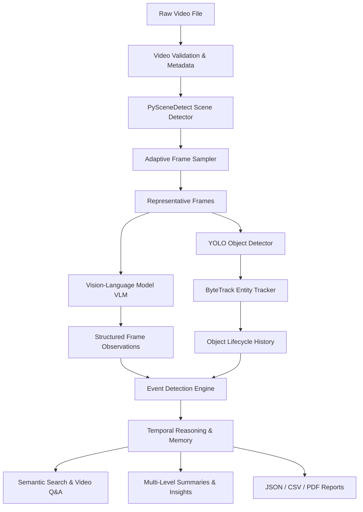

# 🎥 VisionTrace AI — Advanced VLM Video Intelligence & Analysis Platform

**VisionTrace AI** is a production-quality, visual-only AI Video Intelligence and Understanding Platform powered by Vision-Language Models (VLMs), Ultralytics YOLO object detection, ByteTrack tracking, temporal event reasoning engines, structured video memory, and grounded Q&A with evidence retrieval.

> [!IMPORTANT]
> **Strict Audio Exclusion**: Audio tracks, speech recognition, Whisper, audio transcription, speaker identification, and audio sentiment analysis are strictly excluded. The platform focuses exclusively on visual video understanding and temporal reasoning.

---

## 🌟 Key Features

1. **Video Upload & Ingestion**: Format validation (.mp4, .mov, .avi, .mkv), resolution, duration, FPS, FourCC codec extraction, and SHA-256 hash identity.
2. **Scene Segmentation & Adaptive Sampling**: PySceneDetect scene boundary detection combined with duration/motion-based representative frame sampling.
3. **Configurable VLM Frame Analysis**: Pluggable `VLMProvider` interface (Gemini 2.5 Flash, OpenAI GPT-4o, Custom VLM, or Mock VLM fallback) outputting validated Pydantic JSON schemas.
4. **YOLO Object Detection & ByteTrack Tracking**: Class detection, normalized bounding boxes, confidence thresholds, and entity identity tracking over time (`first_seen`, `last_seen`, `activities`, `interactions`).
5. **Event Engine & Temporal Reasoning**: Automatic conversion of per-frame observations into timed higher-level events (`MOVEMENT`, `OBJECT`, `PERSON`, `SCENE`) and chronological step-by-step timeline.
6. **Structured Video Memory**: Persistent JSON memory storing entities, scenes, frames, detections, tracks, events, timeline, and multi-level summaries.
7. **Grounded AI Video Q&A**: Natural language Q&A against video memory categorizing answers into *Observed Facts*, *Inferences*, and *Unknowns*, with timestamp evidence jump links.
8. **Semantic Video Search**: Vector embeddings and cosine similarity for natural language scene querying.
9. **Visual State Change & Anomaly Detection**: Flagging visual state changes and potential anomalies using non-judgmental language.
10. **Multi-Format Export**: Full JSON export, CSV timed events export, and executive PDF analysis reports.

---

## 🏗️ System Architecture



---

## 📁 Project Structure

```text
visiontrace-ai/
│
├── app.py                      # Main Streamlit application entrypoint
├── requirements.txt            # Package dependencies
├── README.md                   # Platform documentation
├── .env.example                # Environment variables template
├── .gitignore                  # Git exclusions
│
├── config/                     # Settings and environment configuration
│   ├── __init__.py
│   └── settings.py
│
├── frontend/                   # Streamlit UI & components
│   ├── __init__.py
│   ├── dashboard.py            # Main application dashboard
│   ├── video_player.py         # Video player & information panel
│   ├── timeline_ui.py          # Interactive chronological timeline
│   ├── analytics_ui.py         # Tracked entities & scene cards
│   └── components.py           # Custom dark theme CSS design system
│
├── video/                      # OpenCV & PySceneDetect pipeline
│   ├── __init__.py
│   ├── processor.py            # Master video ingestion & pipeline manager
│   ├── metadata.py             # Metadata extractor
│   ├── scene_detector.py       # Scene segmentation engine
│   ├── frame_extractor.py      # OpenCV frame extractor
│   ├── sampler.py              # Adaptive representative frame sampler
│   └── validator.py            # Format & constraint validator
│
├── vision/                     # Vision-Language & Computer Vision
│   ├── __init__.py
│   ├── vlm.py                  # Pluggable VLM provider interface
│   ├── frame_analyzer.py       # Structured Pydantic VLM analyzer
│   ├── object_detector.py      # YOLO object detector
│   ├── tracker.py              # ByteTrack entity tracker
│   └── visual_features.py      # Bounding box & feature utilities
│
├── intelligence/               # Event Engine & Temporal Reasoning
│   ├── __init__.py
│   ├── event_detector.py       # Timed event generator
│   ├── action_analyzer.py      # Action & interaction aggregator
│   ├── temporal_reasoner.py    # Timeline synthesizer & summary builder
│   ├── key_moment_detector.py  # Importance ranking detector
│   ├── anomaly_detector.py     # Visual state change & anomaly engine
│   ├── video_memory.py         # VideoMemory storage manager
│   └── insights.py             # Temporal insight synthesizer
│
├── retrieval/                  # Embeddings & Semantic Search
│   ├── __init__.py
│   ├── embeddings.py           # Vector embeddings & cosine similarity
│   ├── semantic_search.py      # Natural language scene search
│   └── evidence_retrieval.py   # Grounded evidence retriever
│
├── qa/                         # Video Question Answering
│   ├── __init__.py
│   └── video_qa.py             # Grounded Q&A engine
│
├── reports/                    # Export Generators
│   ├── __init__.py
│   ├── report_generator.py     # Multi-format report orchestrator
│   ├── json_export.py          # JSON & CSV exporter
│   └── pdf_export.py           # PDF report builder
│
├── models/                     # Data Models & Schemas
│   ├── __init__.py
│   └── schemas.py              # Pydantic data schemas
│
├── utils/                      # Helper Utilities
│   ├── __init__.py
│   ├── logger.py               # Structured logging
│   ├── time_utils.py           # Timestamp & frame converters
│   ├── file_utils.py           # File hashing & validation
│   └── caching.py              # Disk JSON caching layer
│
├── prompts/                    # Structured VLM Prompts
│   ├── frame_analysis.txt
│   ├── temporal_reasoning.txt
│   ├── event_detection.txt
│   ├── video_summary.txt
│   ├── video_qa.txt
│   └── anomaly_detection.txt
│
├── uploads/                    # Directory for uploaded raw videos
├── processed/                  # Directory for sampled frames & memory
├── outputs/                    # Directory for exported reports
│
└── tests/                      # Automated Test Suite
    ├── run_tests.py            # Unit test runner
    ├── test_video.py           # Video validation & metadata tests
    ├── test_sampling.py        # Scene detection & sampler tests
    ├── test_vlm.py             # VLM frame analysis tests
    └── test_events.py          # Event engine tests
```

---

## ⚡ Quick Start

### 1. Install Dependencies
```bash
pip install -r requirements.txt
```

### 2. Configure Environment Variables
Copy `.env.example` to `.env`:
```bash
cp .env.example .env
```
Configure your VLM provider and API key in `.env`:
```env
VLM_PROVIDER=gemini
GEMINI_API_KEY=your_gemini_api_key_here
VLM_MODEL=gemini-2.5-flash
```
*(Note: If no API key is provided, the platform automatically activates Mock VLM fallback for zero-cost local testing.)*

### 3. Run Automated Tests
```bash
python tests/run_tests.py
```

### 4. Launch Application
```bash
streamlit run app.py
```

---

## 🧪 Verification & Testing

Run all unit tests:
```bash
python tests/run_tests.py
```
Output:
```text
Ran 6 tests in 3.936s
OK
```

---

## 📜 License
MIT License
# VisionTrace

